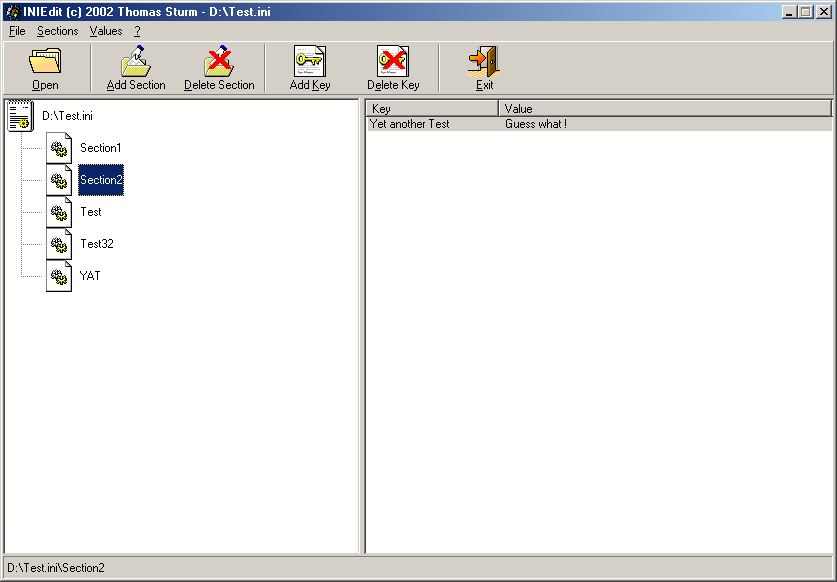

<div align="center">

## INIEdit \- Registry Editor Style


</div>

### Description

Yesterday, somebody submitted a Class for INI Files which got quite a positive response. So, I thought, I could throw in my 2 cents about INI Files with this one.
 
### More Info
 


<span>             |<span>
---                |---
**Submitted On**   |2002-04-03 20:24:06
**By**             |[Thomas Sturm](https://github.com/Planet-Source-Code/PSCIndex/blob/master/ByAuthor/thomas-sturm.md)
**Level**          |Advanced
**User Rating**    |4.9 (39 globes from 8 users)
**Compatibility**  |VB 6\.0
**Category**       |[Complete Applications](https://github.com/Planet-Source-Code/PSCIndex/blob/master/ByCategory/complete-applications__1-27.md)
**World**          |[Visual Basic](https://github.com/Planet-Source-Code/PSCIndex/blob/master/ByWorld/visual-basic.md)
**Archive File**   |[INIEdit\_\-\_68353432002\.zip](https://github.com/Planet-Source-Code/thomas-sturm-iniedit-registry-editor-style__1-33393/archive/master.zip)

### API Declarations

```
5
All about INI Files
```


